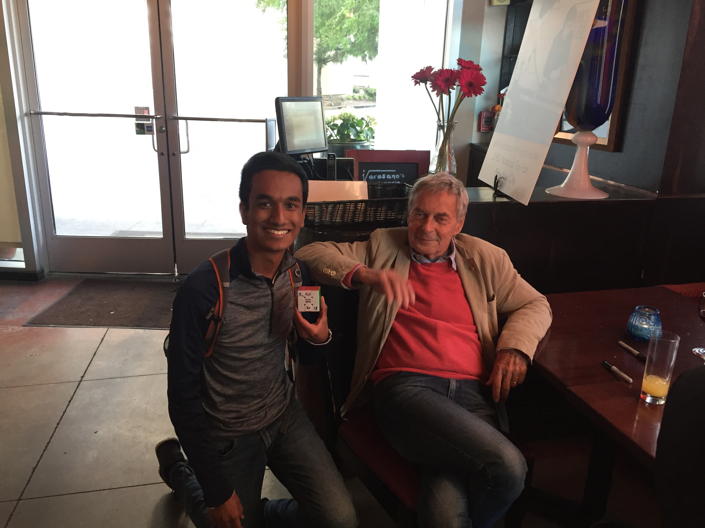
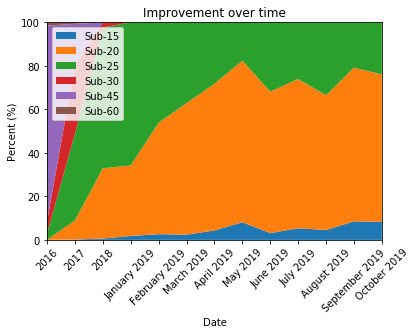
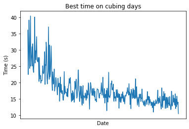
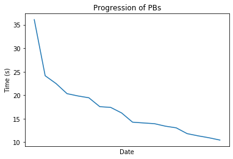

I like solving Rubik's cubes. I have one with 20 feet of myself at all times (a bit of an exaggeration, but pretty close to the truth). Here's a picture of me with Erno Rubik, the inventor of the cube!



He's a very nice person. Anyways, I've been solving for years, and I finally asked the question: "Have I improved?" Over the years, I've ammassed a collection of several thousand solves. My dataset includes timestamps, solve times, scrambles used (when available), and averages. My friend/fellow nerd Jacob suggested I use Python to poke at my data and see what came out. I had some previous coding experience, but none with Python, so I had no idea what I was getting into. Turns out, Python is a pretty friendly language!

After importing the data to a Jupyter notebook, I got to work.

### Box It Up

In cubing, when people ask, "How fast are you?", there are two ways to respond. One is to give your fastest single solve. Another is to say, "I am sub-x." Here, x is a neat whole number like 60, 30, 20, 15, etc. This means in general that over an arbitrary set of solves, your average time will be below that cutoff. For example, I currently consider myself sub-20, moving towards sub-15. But am I actually sub-20? I was curious what percentage of my times fit into which boxes. 

My solution was to parse through the data and split the data based on date. Everything in a given past year was lumped into one group, and everything in the present year was split by months. This meant I could quickly see how I had improved from 2016 to 2017, 2017 to 2018, and how progress was going throughout 2019. Then I categorized the times by my arbitrary cutoffs: Sub-60, -45, -30, -25, -20, and -15. For example, if a solve was between 30-60 seconds, it was sub-60. All my data would fit into one of these boxes. Since every month or year had a variable number of solves, I normalized the data to give me percentages. After some ~~very professional~~ amateur coding, I came up with this graph.




First, you'll notice that sub-60 times aren't visible. Rest assured, they are there! They simply vanished after the first few months of data from late 2016 into early 2017. You'll notice I rapidly improved over the first few years, but progress in 2019 has slowed. That's because as I get faster, the room for improvement shrinks. I have to optimize specific aspects of my solve that don't become immediately apparent. 

Sub-20 times started arriving in 2017, but didn't become the majority of solves until early this year. As of this post, Roughly 75% of my solves are below 20 seconds. That's good enough for me to call myself sub-20! There are some significant peaks and valleys through the later part of this year, mostly due to the fact that I didn't have a ton of solves in those months and minor mistakes can very quickly look like unscalable peaks.

My favorite part of this graph is the blip of sub-15 times in 2018 turning into a noticeable chunk in 2019. Granted, they make up a small portion of the data, but they are there and they are growing! One of my biggest cubing goals is to confidently call myself sub-15. That means I expect to see what is a little notch now grow to dominate the rest of the graph. 

### Another Day, Another Solve

Cubers (and humans in general) tend to fixate on personal bests, but I wanted to know something a little different. On any given day that I cubed, what was my best time of that day alone? My best time on July 9, 2017 might have been a 27.81s, but I might have had a best time of 32.33s three days later. 

This one was pretty easy to implement. For every day in the data set, I picked the first time and made it the best time of the day. Then I kept going until either a) I started a new day or b) I found a better time. The end result looks like this: 



As you can see, in the recent past, I am likely to have at least one time under 15 seconds and almost guaranteed to have a solve under 20. This is encouraging! It means my best is getting better on a consistent basis. You'll notice the graph appears to be tapering off, but I don't think this is my limit. I know of several ways to improve my times (I've begun implementing them) but results take time to show.

### Best of the Best

This next section is fairly self-explanatory. How have my all-time bests improved?

The implmentation is super easy. Start with the first recorded solve, and make that your "best". Then go through each solve after that. If you find something better, add it to the list. Keep on going until you hit the end. Finally, you get this result.



I find this to be one of my favorite visualizations. I very quickly drop my best time from over 35 seconds to under 25, and I never look back. The biggest drawback is that the x-axis isn't spaced by date properly; they're spaced evenly which isn't how these solves are set. That's something to be fixed at a later date. Regardless, the trend is visible. My second major cubing goal is to have one solve under 10 seconds. If I can acheive that, I've joked, I'll retire happy. And by the looks of it, I'm not too far off! I recently broke the sub-10.5 barrier (super arbitrary, I know, but you take your wins where you can) with a time of 10.46 seconds. I never imagined a day where I would be on the precipice of reaching my biggest cubing goal, yet here we are. So close! This makes me want to pick up a cube and just keep solving, because you never know when a personal best will strike. 

### Scorigami!

This concept is a little silly, but I find it pretty cool. Jon Bois is a sports writer/data nerd. He created the concept of [scorigami](https://www.youtube.com/watch?v=9l5C8cGMueY), defined as "the art of achieving a final score in an NFL game that has never happened before." For example, in 2019, the Ravens beat the Dolphins 59-10, a score that had never occurred in the NFL prior. Of course, I wanted to apply this to cubing. Times are measured in hundreths of seconds (timers used in competition aren't yet good enough to measure milliseconds). For example, between 8.00 and 9.00 seconds, there are 100 possible unique times. I wanted to know how many I had reached between my worst and best times. 

This was done by finding the set of all unique times I had acheived and subtracting it from the set of all possible unique times between my best and worst solves. I also wanted to know how many of my times had only been reached once (for example, my personal best has only been achieved once). The code whirred away in the background for a while and gave me these results: 
```

    Between my best time of 10.46 s and my worst time of 58.15 s, there are 4769 possible unique times.
    Unique times are discretely measured in units of 0.01s. One term used to describe specific rare instances of a score is scorigami, invented by Jon Bois.
    I have achieved 2245 of them. This is 47.07 % of all possible scorigami times.
    The time that appears the most frequently is 20.52 s.
    There are 601 times that occur only once. These are true scorigamis. They had never been done before and have not been achieved since.
```

This was very interesting to me. I've reached less than 50% of this set of unique times. This makes sense; in the early days, I was improving rapidly, so I very quickly stopped having very slow times. Later, as I stabilized, I started getting more and more of the same solve times and only occasionally delving into new territory. Again, this means absolutely nothing, but it's still fun to look at. 

And that's my journey through cubing data! I still have a few things that I'd like to do, listed below. Primarily I'd like to run this same analysis on my averages of 100 solves. This is better indicator of how consistent (or inconsistent) my solves have been over the last few years. A couple things need to be tweaked here and there, like the axes on some graphs, but this is it. Now if you'll excuse me, I have to go solve a cube. :)

## TODO:
### Progress evaluator for Ao5, 12, 100, etc.: To be implemented
### PB Tracker: In progress, must fix x axis ticks
### Weekday Evaluator: To be implemented
### Day-by-day PBs: In progress, must fix x axis ticks
### ~~Modal time: Done!~~
### ~~Scorigami (times I've never reached, H/T Jon Bois): Done!~~
