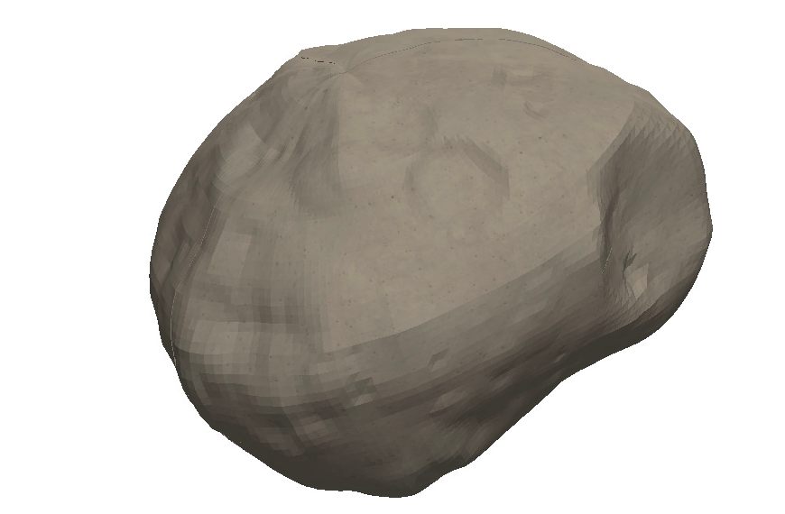

If you've met me, you know I like space. The infinite nature of the universe, our smallness in comparison, the unending possibilities of discovery. You also know I like Rubik's cubes. On a smaller scale, the cube is equally infinite. There are over 43 quintillion permutations of the 3x3 cube, a set of possible states far beyond what any human is capable of reaching in a thousand lifetimes. 

So why not combine the two? Kenneth Brandon, a YouTuber/cuber under the handle RedKB, designed a [custom cube](https://www.youtube.com/watch?v=m2uIrAUhsXk) by 3D printing his company's logo with a hole in the middle just big enough for a 2x2 cube internally. This inspired me to create my own edition of a custom 3D printed cube.

### Aim for the Moon

Step one is to select a planetary body as the basis for my model. I chose Phobos, the larger of Mars' two moons. I had a few reasons for doing so.

- My senior design team is currently designing a mission to Phobos. It's a fascinating satellite that we don't know a lot about and I've grown to love it.
- Phobos has a massive crater named Stickney that is incredibly interesting in its own right. But for our purposes, it's a unique feature that would be cool to render in a 3D model.
- Phobos looks like a potato. Who doesn't like potatoes?

*Stickney is the massive cavity on the side of Phobos. [Credit: Viking Project, JPL, NASA](https://apod.nasa.gov/apod/ap181125.html)*

### Roll Model

The next step is to begin the modeling process. RedKB's procedure was to create the logo he wanted, extrude it out, cut a hole out for the cube in the center, and split it across the three planes (XY, XZ, and YZ) to allow rotation. Unfortunately, Phobos isn't a 2D shape that can be easily extruded upwards from a sketch. However, there are many models already available for use! I found mine [here](https://3d-asteroids.space/moons/M1-Phobos). This website has many different models of Phobos with varying resolutions. I chose the lowest fidelity for a couple of reasons.

- I didn't know how good the 3D printer I would use is. Having a hyper-accurate rendition of Phobos wouldn't be useful if the printer couldn't capture the resolution. 
- The higher fidelity models nearly broke SOLIDWORKS, the modeling software I was using. There were simply too many individual features that couldn't be efficiently rendered even on the virtual machine I was running the software on. This would have been fine if I just needed to run it once, save the file, and call it a day. But I needed to manipulate and cut the model, and every minor change would take several minutes to run. That compounded if I made a mistake and had to undo and redo everything.

I loaded up the Thomas model from the previously referenced link and this is what that looks like. I resized it to something I thought was reasonable and ended up with this.

*Stickney Crater is visible on the right side of the body.*

That's nice, but that's just a solid body. So I sketched a square and extruded it into a cube at the center of Phobos. Then I told SOLIDWORKS to subtract the cube from Phobos and just like that, I have a cube-shaped hole in the middle. The specifics of the size of the hole will depend on the model of 2x2 used in the center of the cube. I chose the [Z Mini 2x2 Keychain Cube](https://www.thecubicle.com/collections/2x2/products/z-mini-2x2-keychain-cube) from The Cubicle. (This isn't a sponsored post, I just like The Cubicle!) It had a few advantages. For one, it's very cheap. Second, it's very small - at 35mm to a side, it lets me print a slightly smaller puzzle. Remember, the actual size of the puzzle will be much larger than the 2x2 used in the center, so minimizing this will result in a more manageable size overall. Also, the keychain itself is removable, so I've got no concerns with that. 

You can't see this in the images above, but Phobos is split across the three planes in order to create 8 unique parts. Every part is slightly different on the outside, but that's the beauty of it! Finally, we have to polish up each of the pieces. Long-time cubers will remember when every piece on the cube was square and blocky. This made them useless for cubing. So I went through each piece and rounded each corner that would interact with another piece. 

This is a little tricky to do on corners in SOLIDWORKS, but I found [this thread](https://forum.solidworks.com/thread/208044) to be useful. In a nutshell, select all the edges leading to a given vertex, then select Fillet. Set the actual fillet to be something very small, almost nonexistent. Then set the Setback Parameter to be what you'd like the actual radius of curvature of the vertex to be. In my case, I used a fillet of 0.001 mm and a Setback Parameter of 3mm. Click the vertex to apply it to, then Set All, and save the fillet. That does it quite nicely. Repeat for all eight pieces, and you're good to go! 

*Whaddya mean, we don't know what the interior of Phobos is like? I've got it right here!*

Finally, export every piece to an STL file and head to your nearest 3D printer!

### Printing a Moon

This is the fun part. The aerospace department at Georgia Tech has its own [Maker Space](https://ae.gatech.edu/aero-maker-space) for student use, including 3D printers. I headed there, submitted my print, and that was that. 

