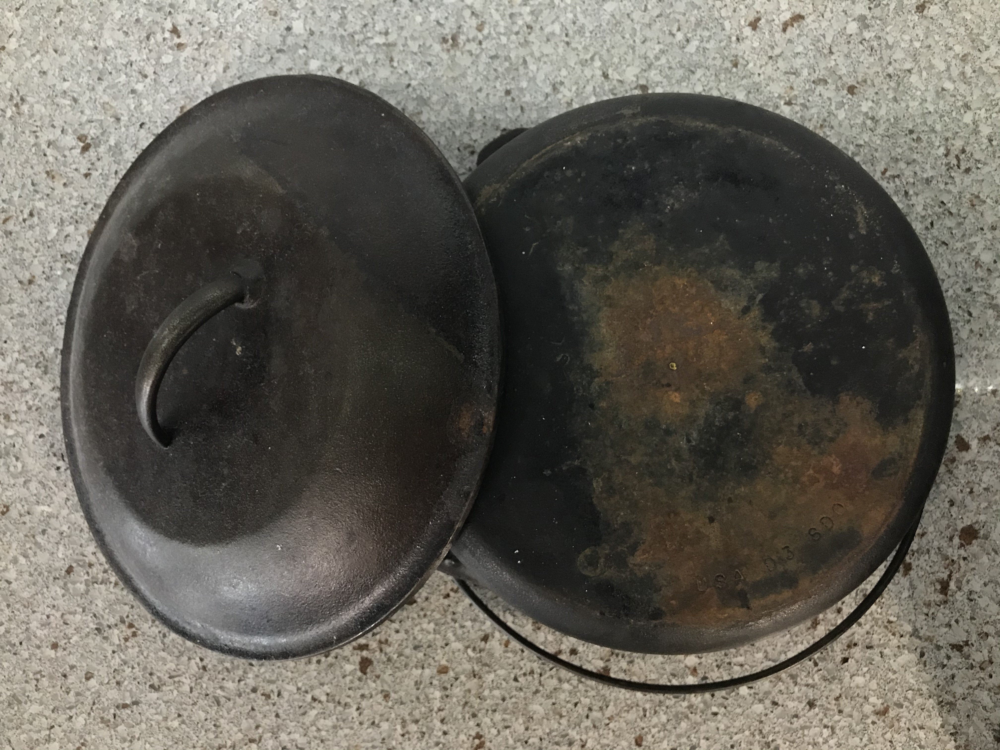
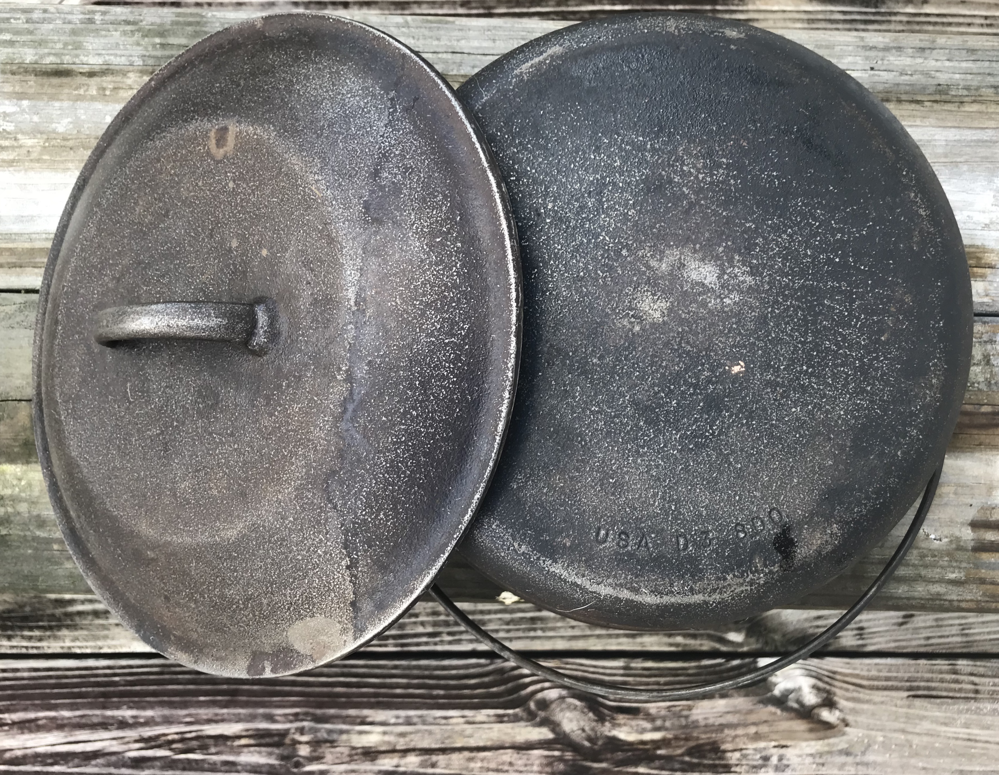
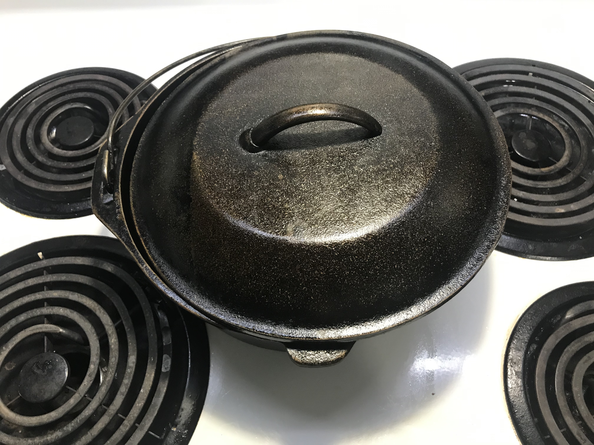
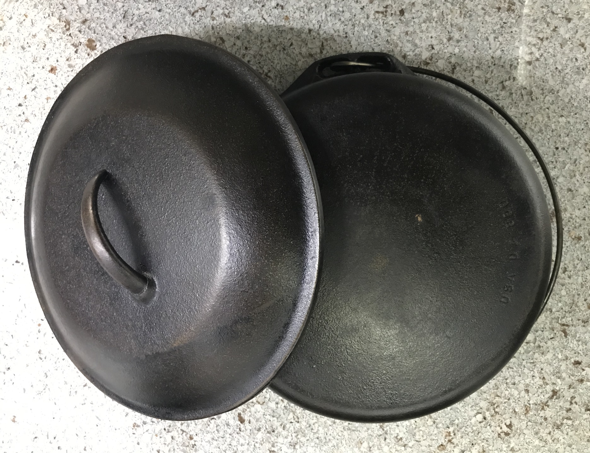
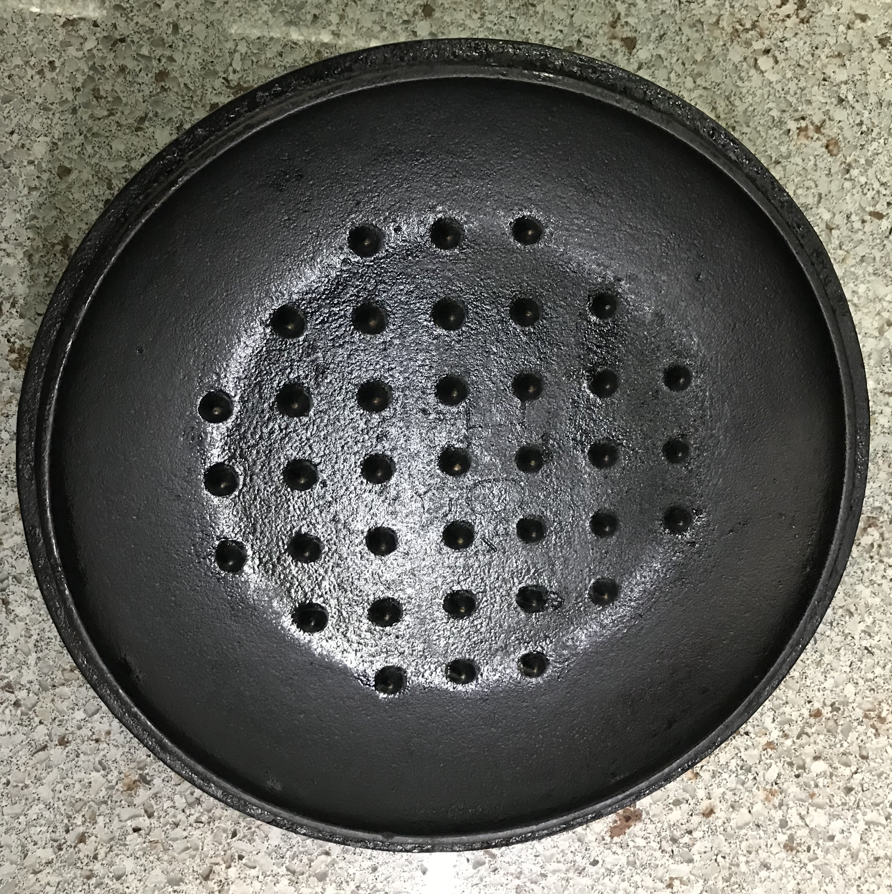

Cast iron cookware is the greatest cookware on the planet. There, I said it. I received my first cast iron skillet shortly before leaving home for college. I was an ignorant novice and completely failed to properly maintain it. I ended up with a sticky, gunky mess at the bottom of my skillet that left it completely unusable. I tried so many tips and tricks but usually ended up with a worse product. Then one day, I found [Cowboy Kent Rollins](https://www.youtube.com/channel/UClrMJRlvoyoWsVlB-7c61PQ). This man's tutorials singlehandedly saved my cast iron skillet from a sad demise. I managed to transform my skillet from a useless lump of metal into a smooth, magnificent piece of cookware. I've made apple pies, garlic bread knots, eggs, bacon, pizzas, hash browns, you name it. Cast iron is insanely versatile and will be your best friend - if you treat it right.

A friend heard of my love of cast iron and when his coworker was getting rid of a Dutch oven, thought to himself, *I bet Joshua would like this.* Turns out, he was right! It was a beautiful piece that had been seasoned well over the years but had recently acquired some undesirable characteristics.

The underside had garnered a significant amount of rust and there were some problem spots on both surfaces of the lid. So one cool, blustery January morning, I got to work.

## Out With The Old
To begin, I wiped the pot down with paper towels and low-grit sandpaper. The sanding removed a bit of the seasoning and a lot of what didn't need to remain. I wasn't too concerned with losing some seasoning; I would build that back up later. You can see bits of the original metal shining through in the picture below, which is exactly what I wanted to see. But this wasn't enough; there was still plenty of rust left.

To combat this gross orange oxidization, I scrubbed the entire pot with some steel wool and a vinegar-water solution. In general, you should **not** use steel wool on cast iron. The only reason this is acceptable is because I'm restoring this piece and this is not part of my normal cleaning routine. After that round of scrubbing, I was quite pleased with the results.

*The inscription reads "USA D3 8D0".*

Look at that! What a difference. You can actually legibly read the model number across the bottom of the pot; the internet tells me that this is most likely a Lodge brand Dutch oven made in the 1930s or 40s. This is why I love cast iron; with a little bit of TLC, a good piece will last you a lifetime and then some.

Next, I washed my pot with soap and water. Now depending on who you ask, this can be grounds for termination from the Official Cast Iron Fan Club. But I was rebuilding almost from scratch. I wanted a clean pan that I could work with, and that's what I was going to get.

I finished with one final rinse of steaming hot water. Hot water is great because a) it likes to kill pathogens and b) it evaporates quickly. And when it comes to cast iron, you do not want any amount of moisture. So I immediately toweled off the pot and introduced it to the interior of a screaming hot oven for 10 minutes. That got rid of any remaining moisture.

## In With the New...Old
We're not done yet! To have a piece of cast iron cookware that's ready for primetime, you need a good layer of seasoning. 

*I wanted the pot just barely glistening after I finished applying the oil. A thick layer is a good seasoning's worst enemy.*

A thin layer of vegetable oil (or other neutral oil) across the surface of the pot is perfect. Now you may ask, "Which surfaces should I season?" And the appropriate answer is, "The ones you don't want to rust." I don't remember where I first read or heard this, but it is so true. No Achille's heel here! Every nook and cranny was covered. Then it went back into the oven for an hour-long curing session. I repeated the process until I was happy with the results. And boy, was it an improvement!

*Remember how rusty this was?*

*No more bare metal here!*

*These little pegs protruding from the lid are self-basting pegs. When liquid evaporates during the cooking process, it encounters this lid, condenses, and falls back onto the food below.*

So smooth, so beautiful. I am ready to cook, but I don't have any recipes! If you have a great meal that I can make with this pot, let me know!

## Why Cast Iron?
After reading this, you may be asking, "Joshua, why on earth would you go through such a time intensive process when you could buy a nonstick pan for $20?" I believe cast iron provides more to me than any average pan would, and here's why.

**I've learned patience.**

If there's one thing restoring cast iron teaches you, it's patience. It takes time to scrub and sand and season. It's nitty gritty work that requires an eye for detail. In the process, I've grown to appreciate the time it takes to maintain and care for what I own. In an age where immediate gratification is constantly rewarded, having to work for something is a breath of fresh air.

**I've learned to appreciate the vintage.**

My generation and those younger than I are growing increasingly disillusioned with the previous generation. There's a reason "Ok, Boomer," became the calling card of Gen-Z. I'm not here to debate the choices that Baby Boomers have made. I am going to question whether it is wise to reject them wholesale. I think it is dangerous and naive for a generation to dump their ancestors because of past and present mistakes, perceived or actual.

The Apollo missions were the peak of the American space program. Think of it: we removed humans from the surface of the Earth and placed them on a floating rock 239,000 miles (384,000 km) away. Do we continue to use the Saturn V today? Of course not. We've made significant improvements since then - not in spite of Apollo, but because of it. Should we demolish Launch Pad 39A because it's a reminder of our past? Again, no. SpaceX currently leases the pad and has refurbished/modified the pad for their own Falcon launches.

Buzz Aldrin was the second human to walk on another planetary body. His training and execution during the mission was what led humanity's biggest step and we celebrate that fact. But we also know that he flipped a switch that led to the almost mission-ending 1202 error during Apollo 11's descent to the surface. Should we cease our congratulations? I think that would be a premature decision. Perhaps it would be wiser to rejoice in the good and learn from the bad.

Good cast iron instills an appreciation of the past. I feel the same way about vinyl records. Don't get me wrong - neither are convenient. Cast iron is ridiculously heavy and vinyls are fragile. It's easier to stream an album on Spotify or fry an egg in a Teflon pan. But vinyl carries a story with it; my favorite Christmas record is marred with scratches and blips because it had been used so well by its previous owners. Cast iron is a treasure that I can pass on to my children that will (hopefully) recall joyful memories.

I'm not suggesting that we root ourselves in the past. Far too many people and companies have made that mistake and paid the price. I digitized that Christmas record and have a copy on my phone, scratches and all. I own brand-new Lodge skillets that were made in this century and cook in nonstick pans almost daily. But I think honoring the past, respecting those that came before us, and learning as much as possible from their failures and triumphs will be far more valuable than dismissing them with a wave of the hand.

**I've learned redemption.**

Cast iron is never too far gone. Neither are you. I believed that my first skillet was beyond the point of redemption. Then I learned how to properly restore it. I've made so much good food with it since then. Not just for myself, because that's the beauty of food: it was made to be shared. Conversations around tables were sparked because the food that emerged from that pan had a personal story behind it. The crags in the pie crust, the pockets of pillowy goodness in the rolls, and the juicy burgers were all a result of a restored skillet.

I've found that it's true of me as well. I used to be so free as a child. Then things happened. We all have events like those in our lives. I turned inward and cocooned myself away in the name of protection. But we were never meant to live in bubbles. This, I believe, is the heart of Christ's message to our world. Jesus did not come to erase the past; He came to redeem it. When He rose again, He still bore the scars of the nails that pinned His arms to a wooden beam. Centuries later, we partake in communion to focus on His death, not resurrection. 

If you're reading this, you're not too far gone. You're still not beyond the grip of grace. You were crafted as a masterpiece. Does it not look like it right now? That's okay. Just let Him start the process. I'm learning again what it means to be free like a child. Is it easy? Not necessarily. It's involved some deep scrubbing to peel away layers that were corrosive. But is it worth it? A thousand times over, yes. And I am confident that the Creator who started this work is going to make something beautiful yet.