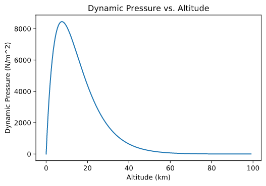

When I was 12 years old, I watched the Space Shuttle Endeavour lift off on mission STS-127. It launched into a blue Florida sky before disappearing behind a layer of clouds, leaving me hooting and hollering on the ground near Cape Canaveral. Among the seven astronauts on board was Colonel Douglas G. Hurley on his first spaceflight. Hurley would also fly on STS-135, the final Shuttle mission.

But today, history repeats itself. Doug Hurley will launch as commander of SpX-DM-2. Hurley and Colonel Bob Behnken will make up the first crewed mission to leave American soil in almost 9 years. Even more exciting is that the launch vehicle is a SpaceX Falcon 9, an important milestone in the future of commercial spaceflight. When they launch, I will be acting just like my twelve-year-old self — hooting, hollering, and interminably grinning.

My friend group is, unsurprisingly, made up of many non-space nerds. They know that I am absurdly excited for this mission but not necessarily all the details. So, I decided to write a guide for today's launch activities. I'm also including a few "Easter eggs" to keep an eye out for! A lot of this guide is taken from Everyday Astronaut, one of the best voices on the internet for all things space. [His guide](https://everydayastronaut.com/crew-dragon-timeline/) details many of the major events that will take place before and during the launch. Make sure to tune into his [YouTube channel](https://www.youtube.com/channel/UC6uKrU_WqJ1R2HMTY3LIx5Q) for a live stream of the launch!

I'm dividing this guide into pre-launch and post-launch sections. At the beginning of each section is a summary table with a short description of what's happening, as well as what time it should be happening. (NOTE: Launch time is subject to change! I will update this page if I receive new information. The countdown times should remain constant relative to launch at T-0, however.)

Click [here](#pre-launch) for pre-launch and [here](#post-launch) for post-launch.
---
## Pre-Launch

I've written short explanations for some of the events; click the links or scroll down below the table for explanations.

| Time (Eastern) | Countdown Time (hr:min:sec) | Event                                                                                                     |
|:---------------|:---------------------------:|----------------------------------------------------------------------------------------------------------:|
| 11:33:34 AM    | T-04:59:59                  | [IMU Alignment](#imu-alignment-t-045959)                                                                  |
| 12:03:33 PM    | T-04:30:00                  | [RCS/Abort Fuel Pressurization](#rcsabort-motors-fuel-pressurization-t-043030)                            |
| 12:18:33       | T-04:15:00                  | Crew weather briefing                                                                                     |
| 12:28:33       | T-04:05:00                  | [Crew handoff](#crew-handoff-t-040500)                                                                    |
| 12:33:33       | T-04:00:00                  | [Suit up begins](#suit-up-t-040000)                                                                       |
| 1:11:33        | T-03:22:00                  | Checkout complete                                                                                         |
| 1:18:33        | T-03:15:00                  | [Depart for 39A](#depart-for-39a-t-031500)                                                                |
| 1:38:33        | T-02:55:00                  | [Arrive at 39A](#arrive-at-39a-t-031500)                                                                  |
| 1:53:33        | T-02:40:00                  | Crew Access Arm Arrival                                                                                   |
| 1:58:33        | T-02:35:00                  | Enter Crew Dragon capsule                                                                                 |
| 2:13:33        | T-02:20:00                  | Comms check                                                                                               |
| 2:18:33        | T-02:15:00                  | Seat rotation                                                                                             |
| 2:19:33        | T-02:14:00                  | Suit check                                                                                                |
| 2:38:33        | T-01:55:00                  | Crew Dragon hatch closes/ground support leaves                                                            |
| 3:23:33        | T-01:10:00                  | [ISS ephemera upload](#iss-ephemera-upload-t-011000)                                                      |
| 3:48:33        | T-00:45:00                  | [Pre-fuel go/no-go poll](#pre-fuel-gono-go-poll-t-004500)                                                 |
| 3:51:33        | T-00:42:00                  | Crew Access Arm retracts                                                                                  |
| 3:56:33        | T-00:37:00                  | [Launch abort system armed](#launch-abort-system-armed-t-003700)                                          |
| 3:58:33        | T-00:35:00                  | [RP-1 (1st/2nd) and LOx (1st) loading begins](#rp-1-1st2nd-and-lox-1st-loading-begins-t-003700)           |
| 4:17:33        | T-00:16:00                  | LOx (2nd) loading begins                                                                                  |
| 4:26:33        | T-00:07:00                  | [Engine chill begins](#engine-chill-begins-t-000700)                                                      |
| 4:28:33        | T-00:05:00                  | Crew Dragon transitions to internal power                                                                 |
| 4:32:33        | T-00:01:00                  | [Pre-launch checks/prop tanks pressurized for flight](#pre-launch-checksprop-tank-pressurizationt-000100) |
| 4:32:49        | T-00:00:45                  | Flight Director verifies "GO" for launch                                                                  |
| 4:33:30        | T-00:00:03                  | [Ignition sequence start](#ignition-sequence-start-t-000003)                                              |
| 4:33:33        | T-00:00:00                  | LIFTOFF!                                                                                                  |

#### IMU Alignment (T-04:59:59)
The inertial measurement unit, or IMU, is a device that tells the spacecraft where it is, which way it's pointing, and where it's headed. Think of it like a GPS for rockets. For redundancy, there will be more than one IMU onboard. It's important that these are functioning; a Russian Proton rocket once had three angular velocity sensors installed UPSIDE DOWN. As you can imagine, [it did not turn out well](https://youtu.be/WlQH3MHhm0Y?t=1169).

#### RCS/Abort Motors Fuel Pressurization (T-04:30:30)
The Reaction Control System (RCS) is a set of several small thrusters on the Crew Dragon capsule that helps fine-tune the spacecraft's orientation. The SuperDraco abort motors are there to pull the capsule away to safety in case of an emergency. They use hypergolic fuels/oxidizers, which means they ignite spontaneously on contact. This is great for reliability (you don't need an igniter that can fail) but they are notoriously toxic. [This video](https://www.youtube.com/watch?v=AFLmqQ5ceS8) explains more.

#### Crew Handoff (T-04:05:00)
Just a formality; the astronauts are officially handed off from NASA to SpaceX.

#### Suit Up (T-04:00:00)
The astronauts get dressed for success!

**Easter Egg**: Suit up happens at the Neil Armstrong Operations and Checkout Building, named after the first man to walk on the moon.

#### Depart for 39A (T-03:15:00)
Behnken and Hurley depart for the launchpad.

**Easter Egg**: The astronauts will be riding in NASA-themed Tesla Model X vehicles, the first time cars will be used to ferry astronauts to the launchpad. Astronauts formerly rode in the AstroVan on their way to space.

#### Arrive at 39A (T-03:15:00)
The astronauts arrive at the launchpad!

**Easter Egg**: Launch Complex 39A is the most legendary launch complex in history. Almost all Apollo missions left this pad, including Apollo 11 and Apollo 13, as well as 60% of the Shuttle launches. SpaceX currently leases 39A from NASA.

**Easter Egg**: The worm is back! [The iconic NASA logo](https://www.nasa.gov/feature/the-worm-is-back) was retired in 1992 but is making a comeback for this launch. You'll see it on the side of the Falcon 9 launch vehicle and maybe a few other places throughout launch day!

#### ISS Ephemera Upload (T-01:10:00)
The exact position (ephemera) of the ISS is entered into the Crew Dragon's computers. This will allow it to plot its course to the ISS.

#### Pre-fuel Go/No-Go Poll (T-00:45:00)
The flight director will ask each flight controller (communications, guidance, life support, etc.) to confirm that their subsystems are ready ("GO") or not ("NO GO") for launch. Any "NO GO" here will likely result in a scrub of the launch. All "GO"s will allow them to begin fuel-up procedures

#### Launch Abort System Armed (T-00:37:00)
In the event of an emergency during fuel-up, the crew needs a way to quickly leave the launch pad. The launch abort system gives them the ability to quickly get away from the vehicle from now until well after launch.

#### RP-1 (1st/2nd) and LOx (1st) Loading Begins (T-00:35:00)
Fueling begins. RP-1 (Rocket Propellant-1) is essentially a highly refined form of kerosene that is combined with LOx (Liquid Oxygen) and burned. At standard pressure, liquid oxygen must be stored below -300 degrees Fahrenheit. Storing and loading such cold propellant is a technical challenge, but it's practically down to a science by now. RP-1 will be loaded into both stages, but LOx will only load onto the first stage for now. I could go on a much longer rant, but I'll conclude by saying that John D. Clark's [Ignition!](https://www.amazon.com/Ignition-Informal-Propellants-University-Classics/dp/0813595835) is an amazing read on the history of rocket propellants.

**Easter Egg**: When the ultra-cold LOx comes in contact with the inside surface of the rocket, it will cause intense condensation on the outside surface. You will likely see what looks like smoke emanating from the Falcon 9 during this time. Some of this is venting, but quite a bit is just the humidity in the air rapidly converting from liquid to gas. And because it's so cold, if you tried touching the rocket, your hand would freeze to the metal!

#### Engine Chill Begins (T-00:07:00)
Because it's dealing with oxygen at cryogenic temperatures, the engine needs to be conditioned to handle the cold. The engine chill preps it to handle the incredibly low temperatures it will be dealing with shortly.

#### Pre-launch Checks/Prop Tank Pressurization (T-00:01:00)
The checks that need to happen now will occur too fast for humans to handle, so all of this work is placed on the onboard computers. Any failed checks here will result in an automatic scrub.

In a very, very small nutshell, here's how to make a rocket engine work well: take fuel at high pressure/low temperature and spit it out at low pressure/high temperature. This maximizes the amount of energy you get from the fuel and oxidizer. This is why cryogenic liquid oxygen is used and why the tanks are now pressurized to almost 3 times atmospheric pressure!

#### Ignition Sequence Start (T-00:00:03)
The engines are ignited 3 seconds before liftoff. A clamp holds the rocket in place to make sure all nine Merlin engines one the first stage are properly functioning.

**Easter Egg**: The Merlin engines are so powerful, the first stage could have one (or maybe two) engines fail and still get the astronauts to space.

---
## Post-Launch

We're on our way! Here's how we get to the ISS.

| Time (Eastern)          | Countdown Time (hr:min:sec) | Event                                                                     |
|-------------------------|-----------------------------|---------------------------------------------------------------------------|
| 4:34:31                 | T+00:00:58                  | [Max Q](#max-q-t000058)                                                   |
| 4:34:03                 | T+00:02:30                  | [MECO](#meco-t000230)                                                     |
| 4:36:07                 | T+00:02:34                  | Stage separation                                                          |
| 4:36:09                 | T+00:02:36                  | 2nd stage startup                                                         |
| 4:40:45                 | T+00:07:12                  | [1st stage reentry burn](#1st-stage-reentry-burn-t000712)                 |
| 4:42:16                 | T+00:08:43                  | SECO                                                                      |
| 4:42:18                 | T+00:08:45                  | [1st stage landing burn begins](#arrive-at-39a-t-031500)                  |
| 4:42:42                 | T+00:09:09                  | 1st stage lands                                                           |
| 4:45:33                 | T+00:12:00                  | [2nd stage separation](#2nd-stage-separation-t001200)                     |
| ~10:30 AM (5/28)        | ~T+18:00:00                 | Crew Dragon begins docking with ISS                                       |

#### Max Q (T+00:00:58)
There are two major forces acting on the rocket as it rises: the force of the engines pushing it up and the force of the atmosphere pushing it down. This combination is called "dynamic pressure", associated with the variable "q". Max Q is when dynamic pressure is at its greatest on the rocket. There haven't been any major failures at max q in recent history, but this is still an important milestone. The graph below is an example of how dynamic pressure changes as a rocket ascends (this was originally done for a homework assignment).

#### MECO (T+00:02:30)
A few events happen in rapid succession here. First, we have main engine cutoff (MECO), where the 9 Merlins on the first stage shut down. The 1st stage then separates and begins its descent back to earth while another five engines on the second stage light up and continue the journey.

#### 1st Stage Reentry Burn (T+00:07:12)
To keep itself from turning into a toasty ball of fire, the first stage will relight its engines to slow its descent through the atmosphere.

#### 1st Stage Landing Burn (T+00:08:45)
SpaceX will attempt to land the first stage on a drone ship (named Of Course I Still Love You) floating in the middle of the Atlantic Ocean. This is how they reuse their boosters and keep launch costs low. Shortly before the landing burn begins, the second stage will shut down its engines (SECO). These events are unrelated; the two stages are hundreds of miles apart at this point in their journey.

**Easter Egg**: This landing burn is also affectionately known as a "hoverslam".

#### 2nd Stage Separation (T+00:12:00)
The second stage engines will separate from the Crew Dragon capsule, which will continue its journey on to the ISS. There will be live coverage of the docking about 18 hours later.

And that's how Bob Behnken and Doug Hurley will go to space, ushering in a new era of American spaceflight. This is easily one of the most important launches of the decade, and it's one I can't wait to watch. As American astronaut Alan Shepard once said (after waiting in a launch capsule for four hours), "Fix your little problem and light this candle!"