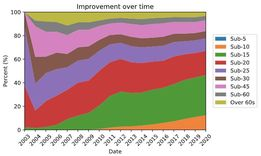
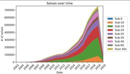
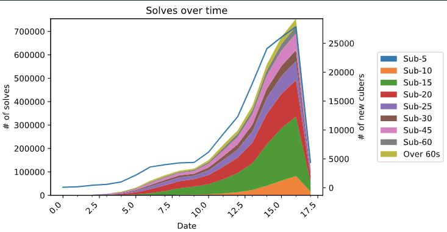

Just over a year ago, I started this blog with a look at my cubing performance over the years. It was a fun project, but I think it's time to broaden the scope. This time, I'm looking at every\* official 3x3 solve.

### Data
My data comes courtesy of the World Cube Association (WCA), the governing body for all things cubing. They manage official competitions, world records, and more across a variety of twisty puzzles. Every week, the WCA publicly releases a database containing competitors, competitions, scrambles, solve times, and more. As with any analysis of a massive data set like this, there are caveats. 

I'm only looking at 3x3 solves that happened after the founding of the WCA in 2003. While the WCA acknowledges solves from the 1982 World Rubik's Cube Championship, I'm ignoring it because a) it accounts for fewer than 60 solves out of more than 3 *million*, and b) it will ruin any reasonable attempt at a time axis. (There were no official competitions from 1982-2003.)

One more caveat: I'm only looking at completed solves. Any solves that were marked Did Not Finish (DNF) or Did Not Start (DNS) were not counted, as they would skew the data unnecessarily. 

### Understanding the Numbers

As before, I categorized each solve into a sub-x category. Drumroll, please...

So, what does this tell us? There are a few things I'd like to focus on.

First, look at the green sub-15 block. At the genesis of the WCA, sub-15 solves were non-existent (I'm not sure why it's showing that there were sub-15s in 2003; there were none). Fast forward to the present, and about 40% of solves now meet that threshold. In other words, if you were to select an Ao5 at random, chances are good that at least 2 of the solves present in that average were under 15 seconds. It's also worth commenting on the rise of sub-10 solves. The first sub-10 occurred in 2007, but it wasn't until 2010 that the top 100 times in the world were all below the 10-second mark. Present-day, they now account for about 10% of all solves. 

After sharing this among some online cubing communities, one person noted a sudden downturn in performance after 2012. There were a few hypotheses presented, but the general consensus among the grizzled old veterans was that cubing had an unexpected renaissance in the public eye, leading to an uptick in new cubers. This results in far more beginners participating, which pulled the overall times slower.

To examine this further, I removed the normalization and looked at the solves as they were. The results were fascinating. If you look closely at the graph below, you'll see the slope changes significantly from 2012 to 2013, especially when compared to 2011-12. This supports the theory that many more cubers joined the ranks, but were relatively inexperienced. 

To further highlight this, I plotted the number of new cubers in every year alongside the number of completed solves. Since the WCA assigns a unique ID to each competitor based on their name and the year they first competed, this was fairly easy to do. (For example, my WCA ID is [2017CHER01](https://www.worldcubeassociation.org/persons/2017CHER01.) This further confirms the hypothesis. For a few years at the turn of the decade, there was a lull in new competitors. Then, beginning in 2013, more and more first-timers began competing.

(Apologies that the date formatted weird; I don't know why it did this.)

All these numbers lead me to posit another question. If we have more amateurs competing than ever before, why is performance still trending faster, not slower? I think there are a few explanations. First, hardware. The cubes of 2020 are far more advanced than the cubes of 2010. Today's entry-level puzzles would probably blow the best cubes of the last decade out of the water. Second, information access. Better algorithms and tutorials are constantly being generated, which means new cubers can learn better techniques from behind a monitor in the comfort of their own home. That means their first solves in a competition are likely to be much better than the first-time solvers of 2012. A 2018 analysis confirmed this; the modal average for a competitor at their first competition was between 20-22 seconds. That means a brand-new competitor today can set an *average* faster than the first world record *single* in 1982.

The events of 2020 have clearly taken a toll on the overall cubing community, as many competitions were canceled. But prior to that, the WCA was experiencing a surge in participation. In fact, the number of new cubers this year so far (4375) is about equal to the number of new cubers in 2012 (4387). As the graph shows, this is the first time cubing numbers have ever trended negatively. So, what does that bode for 2021? Assuming things go back to normal, I think it could be promising. As people have spent months locked down inside their homes, they've turned to new hobbies. Many began baking (much to my dismay, because it became impossible to find yeast anywhere). But others fulfilled a bucket list dream of solving a cube for the first time. I think it's possible that many of these quran-cubers will emerge onto the competition scene with months of practice under their belt. 

### Skew-ering the Numbers

Shortly after sharing these plots with the wider cubing community, I received feedback from a few different people, all saying the same thing. This accounts for a raw number of solves. However, in competition, only the fastest advance to the next round. That means the fastest get more solves, which skews the data to appear, perhaps, just a bit faster than it really is.

Here's my solution: go through the entire data set and retrieve only the fastest solve by a person in a given year. Think of it as a "yearly best". That guarantees that every year that they competed, we have at least one data point. Of course, there are cubers who took a break for years between comps; SeungBeom Cho famously disappeared from the cubing scene in 2015, then returned to set the 3x3 single world record in his second competition after returning in 2017. In this case, we simply have no data point for 2016. 

Surprisingly enough, the graph barely budges, save for shifting downwards a few thousand solves. And by few thousand, I mean the peak of the graph has shifted from 700,000 to 40,000 – a full order of magnitude lower. This makes sense, and it also discredits the theory that fast solvers are skewing the data in their favor.

### Denouement

I love the cubing community because they constantly challenge me to improve my solving game. Little did I know that they would be pushing my coding and stats analysis game as well! This was a fun project because it went far beyond the scope of my previous iteration. There have been some major setbacks this year in terms of competition, certainly. But if the past is any indication, the future looks bright.