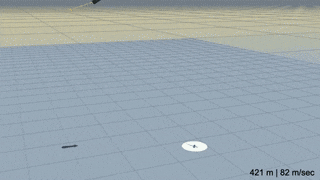

Forty-eight years ago this week, humans left Earth's gravity for another heavenly body. Apollo 17 launched on December 7, 1972, marking the last space mission in which humans would leave Earth orbit. For almost 50 years, we've been constrained to a 500-km sphere above the Earth's surface. But today, we witnessed something that could change all of that. Starship, SpaceX's rocket of the future, just attempted a fearless test to make interplanetary human spaceflight a reality. Unfortunately, most of the coverage I've seen online has painted this test as a failure, which overshadows how groundbreaking this flight really was. I'd like to provide some context and explain why Starship's first "hop" was more than one small step for a rocket-building company.

### What's All This About?
SpaceX is an aerospace company whose goal is to make humans an interplanetary species. Their founder, Elon Musk, has a vision to colonize Mars within the next 15 years. Under the leadership of Musk and their CEO, Gwynne Shotwell (which I believe is the *coolest* last name for the leader of a company building rockets), SpaceX has been consistently pushing the envelope of what's possible with space technology. They're best known for their [landing and reuse](https://www.youtube.com/watch?v=ANv5UfZsvZQ) of first-stage boosters, a concept [originally thought insane](https://qz.com/1016072/a-multimedia-history-of-every-single-one-of-spacexs-attempts-to-land-its-booster-rocket-back-on-earth/) by the engineering heads of other launch providers. To date, SpaceX has landed 68 boosters in 78 attempts.

To reach their goal of interplanetary colonization, however, SpaceX needs to go much bigger. Their current workhorse, the Falcon 9, can only loft 15,000 kilograms to Low Earth Orbit (LEO – about 400 km above the earth). Enter Starship, a massive launch vehicle forecasted to carry over 100,000 kilograms to the same altitude. Starship is an aspirational vehicle that SpaceX intends to use as a crewed lunar (and eventually martian) lander. As with their Falcon family of rockets, reusability is key. The test hop they conducted on December 9 was in support of that goal.

### What Was Supposed to Happen?
After dropping off the second stage in orbit, the Falcon 9 first-stage boosters land by pointing their engine side toward the earth and performing a series of burns to slow down and eventually land. SpaceX is taking a slightly different approach with Starship. During its deorbit, Starship will orient its heat-shield-protected belly to the oncoming atmosphere, similar to how the Space Shuttles returned for their landings. This protects it during the intense heat of reentry in the Earth's atmosphere. (Side note: I analyzed how heat shielding worked on the Apollo missions and how to replace it with cheese. You can read that [here.](https://joshuacherian.github.io/posts/Cheese-Shield)) Unlike the Shuttle, however, Starship has no landing gear. (If you'd like to see a fantastic explanation of how the Shuttle landed, watch [this video.](https://www.youtube.com/watch?v=Jb4prVsXkZU)) In order to not use ground impact as a deceleration tool – also known as "lithobraking" – Starship has to land differently. It does this by refiring its engines, swinging the lower end to face the ground, and gently settling on the landing pad. Here's a simulation by SpaceX of what that would look like.

Instead of sending Starship to orbit and attempting a landing for their first test, SpaceX decided to try something a little tamer. They planned a flight up to 15km (later reduced to 12.5) where they would then perform their "belly flop" maneuver, relight the engines, and performing their seemingly-impossible pendulum-esque touchdown maneuver. 

It's incredibly important to note that SpaceX has a fast design cycle. Musk has previously stated, "Failure is an option here. If things are not failing, you are not innovating enough." SpaceX has embraced this "fail fast" mentality when it comes to development (not human spaceflight, though – they take that responsibility seriously). By utilizing this mindset, engineers push their designs to the limit and reiterate until they find a solution. This has allowed SpaceX to develop capabilities far more rapidly than other competitors in what is historically a risk-averse field. Prior to the flight, Elon Musk predicted a 33% percent chance of actually completing their mission. SpaceX was willing to accept such low odds of success because several more Starships are already waiting in the wings. This test flight was performed on Starship SN8 (Serial Number 8); SN9 has been completed, and SN10-16 are in progress or on the way soon.

### What Actually Happened?
After a last-second abort the day prior and an unexpected hold due to an errant plane entering the range, Starship finally lifted off the ground on December 9 at 4:40 PM Central Time. It performed a series of engine shutdowns during flight, reached apogee (the highest point in the flight), and belly-flopped in a simulated reentry maneuver. Starship made its way back to the landing zone, fired its engines, righted itself...and hit the ground just a little too fast, resulting in a RUD (Rapid Unscheduled Disassembly).

Initial reports from Musk indicated that the pressure in the header tanks – tanks with the fuel/oxidizer needed for the landing – was too low during the landing sequence, which meant the engines couldn't produce enough thrust and slow Starship down in time.

### What Does This Mean?
Many online were quick to call this launch a botched failure, but that's not the way SpaceX sees it. They entered this test expecting – and even planning – for everything to go wrong. The fact that Starship left the ground was success enough. The fact that it performed a magnificent belly flop was a feat in and of itself. The fact that it made its way back to the landing zone, righted itself, and almost perfectly nailed the landing was the icing on the cake. Did the fact that it resulted in a "spectacular explosion," as one of my coworkers called it, make it a failure? Not at all. 

SpaceX is not willing to preserve SN8 at the expense of colonizing Mars. If that's the price they have to pay to visit another planet, so be it. As I mentioned before, they love to fail fast. SpaceX probably learned more from this one real-life test than a hundred perfectly rendered simulations could have taught them, and that made the fireball at the end worth it. More than likely, SN9 is being prepped for its own test flight right now.

So, what does all of this mean for you? You're likely not looking to found your own aerospace company, but you are probably pursuing *something* you consider valuable. What could you gain by allowing yourself to fail fast? Where can you take more risk in order to produce something breathtaking? I don't recommend this approach for everything, but there are some projects or ideas worth abandoning everything else to pursue. Whether it's a buried treasure in a field or a single lost coin, you should count the cost. But when you decide that it's worth more than you could possibly lose, dive in and don't look back.